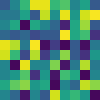

# 👨‍🎨 Aesthetic-Tensor

A simple fluent API for tensor visualization and debugging.

Instead of trying to decipher the default `__repr__` of a _tensor_

```py
T = torch.rand(3, 100, 100)
T
```

```py
>> tensor([[[0.9531, 0.3449, 0.8426,  ..., 0.3743, 0.4693, 0.6880],
            [0.2732, 0.3456, 0.6288,  ..., 0.3619, 0.8134, 0.2392],
            [0.8204, 0.2013, 0.9769,  ..., 0.7117, 0.0643, 0.4224],
            ...,
```

- ugh...

`aesthetify()` you tensors like this

```py
from aesthetic_tensor import aesthetify

aesthetify()  # monkey patch torch.Tensor

T.ae
```

```py
>> float32<3, 100, 100>∈[0.000, 1.000] | μ=0.499, σ=0.288
```

- much better

**you can also**

- **`T.ae.imshow()`**

    ```py
    torch.rand(10, 10).ae.imshow()
    ```

    

- **`T.ae.hist()`**

    ```py
    torch.rand(10, 10).ae.hist()
    ```

    

- **`T.ae.displot`**

    ```py
    (torch.stack([torch.randn(1000) / 2,  (torch.randn(1000) + 4)])).ae.displot
    ```

    

- **`T.ae.ploy()`**

    ```py
    torch.rand(30).ae.plot(figsize=(6, 1))
    ```

    

- **`T.ae.gif()`**

    ```py
    torch.rand(2, 3, 10, 10).ae.N.zoom(10).gif(fps=1)
    ```

     

- Check out the **[docs](#TODO)** for more ways for visualizing.

## But my tensors are frequently batched

Calling the `.N` property on an `AestheticTensor` will give you an `AestheticCollection`,
pulling the leftmost dimension as a batch dimension.
You have the same interface as before, you just apply every transformation to each element.

An example will make everything much more clear.

```py
torch.rand(3, 2, 30).ae.N
```

```py
>>[3](~float32<2, 30>∈[0.032, 0.977] | μ=0.514, σ=0.293)
```

now you can choose how to plot each of the 3 elements of shape `<2, 30>`.

```py
torch.rand(3, 2, 30).ae.N.imshow(figsize=(6, 1))
```


## Resources

- Check out [lovely-tensors](https://github.com/xl0/lovely-tensors) -  a similar library.
